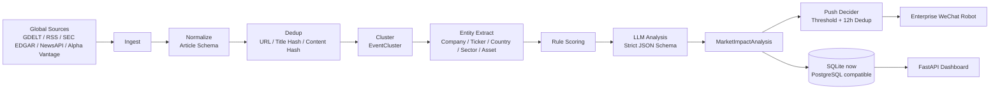

# market-impact-radar

# 全球股市影响新闻雷达

按预测股市影响力排序全球新闻，并推送到企业微信。

**重要声明：本项目不是荐股系统，不提供买卖建议，不提供目标价，不承诺收益。它只用于新闻监测、事件研究和风险提示辅助。**

---

## English Summary

**market-impact-radar** ranks global market news by predicted stock-market impact and sends high-impact events to Enterprise WeChat.

**Disclaimer: This project is not an investment recommendation system. It does not provide buy/sell/hold advice, target prices, or return promises.**

---

## 核心功能

- **全球新闻抓取**：支持 GDELT、SEC EDGAR、RSS、NewsAPI、Alpha Vantage 等来源。
- **多源去重**：基于 `canonical_url`、`title_hash`、`content_hash` 去重。
- **事件聚类**：将同一事件的多篇新闻聚合为 `EventCluster`。
- **市场影响评分**：按 `market_impact_score` 降序排序，而不是按发布时间排序。
- **中文摘要**：生成一句话中文事实摘要和中文影响路径解释。
- **影响资产识别**：识别股票、指数、行业、大宗商品、外汇、债券和国家/地区。
- **企业微信推送**：高影响事件自动推送到企业微信群机器人。
- **Dashboard**：FastAPI + Jinja2 + Bootstrap 的轻量 Web Dashboard。
- **回测与评分校准**：预留评分回测、阈值校准和历史事件评估路线。

## Features

- **Global news ingestion** from GDELT, SEC EDGAR, RSS, NewsAPI, Alpha Vantage, and custom sources.
- **Multi-source deduplication** using canonical URLs and content/title fingerprints.
- **Event clustering** to merge duplicate reports into one explainable event.
- **Market impact scoring** sorted by `market_impact_score`, not publish time.
- **Chinese summaries** and market transmission-path explanations.
- **Affected asset detection** for stocks, indices, sectors, commodities, FX, bonds, and countries.
- **Enterprise WeChat alerts** for high-impact events.
- **Dashboard** built with FastAPI, Jinja2, and Bootstrap.
- **Backtesting and score calibration** planned for historical evaluation.

---

## 架构图



---

## 快速开始

```bash
git clone https://github.com/your-org/market-impact-radar.git
cd market-impact-radar
cp .env.example .env
cp config.example.yaml config.yaml
```

编辑 `.env`，填写 LLM 和企业微信配置；编辑 `config.yaml`，调整数据源、关键词、RSS 和推送阈值。

```bash
docker compose up --build
```

打开 Dashboard：

```text
http://localhost:8000
```

手动触发一次抓取：

```bash
curl -X POST "http://localhost:8000/api/ingest/run?window=24h"
```

### Conda + 清华源

```powershell
conda create -n market_impact_radar python=3.12 -y -c https://mirrors.tuna.tsinghua.edu.cn/anaconda/pkgs/main -c https://mirrors.tuna.tsinghua.edu.cn/anaconda/pkgs/r
conda activate market_impact_radar
python -m pip install -i https://pypi.tuna.tsinghua.edu.cn/simple -e .
Copy-Item .env.example .env
Copy-Item config.example.yaml config.yaml
uvicorn app.main:app --reload
```

---

## 配置项

| 变量 | 说明 |
| --- | --- |
| `LLM_BASE_URL` | OpenAI-compatible API 地址，例如 `https://api.openai.com/v1` 或兼容网关地址 |
| `LLM_API_KEY` | LLM API key，请勿提交到 GitHub |
| `LLM_MODEL` | LLM 模型名 |
| `TRANSLATION_PROVIDER` | 标题翻译备用服务，支持 `mymemory`、`libretranslate`、`disabled` |
| `TRANSLATION_BASE_URL` | LibreTranslate-compatible 服务地址；MyMemory 可留空 |
| `TRANSLATION_API_KEY` | 标题翻译服务 API key，可选 |
| `TRANSLATION_TIMEOUT_SECONDS` | 标题翻译请求超时时间 |
| `WECOM_WEBHOOK_URL` | 企业微信机器人 Webhook，请勿打印或提交 |
| `NEWSAPI_KEY` / `NEWSAPI_API_KEY` | NewsAPI key；当前代码读取 `NEWSAPI_API_KEY` |
| `ALPHAVANTAGE_API_KEY` / `ALPHA_VANTAGE_API_KEY` | Alpha Vantage key；当前代码读取 `ALPHA_VANTAGE_API_KEY` |
| `DATABASE_URL` | 默认 SQLite，可替换为 PostgreSQL URL |
| `CONFIG_YAML` | YAML 配置文件路径，默认 `config.yaml` |

推送阈值在 `config.yaml` 中配置：

```yaml
scoring:
  push_score_threshold: 70
  duplicate_push_window_hours: 12
  score_delta_for_repush: 15
```

---

## 评分逻辑

`market_impact_score` 是 0-100 的综合评分：

```text
market_impact_score =
  event_severity
  + market_scope
  + asset_sensitivity
  + credibility
  + novelty
  + timeliness
  + confidence
```

实际实现中，每个维度会根据权重归一化。默认维度包括：

- `event_severity_score`：事件严重性，例如战争、制裁、违约、央行政策、通胀、能源冲击。
- `market_scope_score`：影响范围，例如来源数量、文章数量、涉及国家、行业和指数。
- `asset_sensitivity_score`：资产敏感度，例如股票、指数、商品、汇率、债券或公司公告。
- `credibility_score`：来源可信度，例如官方公告、监管机构、一线媒体更高。
- `novelty_score`：新颖度，重复转载会降低得分，重大进展会提高得分。
- `timeliness_score`：时效性，但旧新闻如果仍在发酵，不会被机械降为低分。
- `confidence_score`：影响路径清晰度和证据可靠性。

---

## 企业微信推送示例

```text
【全球市场新闻雷达】高影响事件

影响等级：HIGH
影响分数：82/100
影响方向：mixed
影响周期：short_term
事件类型：半导体 / 出口管制

标题：
US expands semiconductor export controls

来源：
Reuters，共 3 个来源

时间：
首次出现：2026-05-13 09:30:00+00:00
最新进展：2026-05-13 10:15:00+00:00

可能影响：
- 半导体：出口限制可能影响供应链、订单节奏和风险偏好。
- Nasdaq：科技权重板块预期变化可能传导至指数。
- 美元：政策不确定性可能影响避险需求。

一句话摘要：
美国扩大半导体出口管制，相关供应链可能重新定价。

影响路径：
该事件可能通过供应链预期、科技板块估值和风险偏好影响相关股票与指数。

主要不确定性：
执行细则和企业实际受影响程度仍需核实。

原文：
https://example.com/news

免责声明：
本消息由 AI 自动整理，仅用于新闻监测和研究辅助，不构成任何投资建议、买卖建议或收益承诺。市场有风险，请独立判断。
```

---

## API

- `GET /healthz`：健康检查。
- `GET /api/events?window=24h&limit=50`：按影响分获取事件列表。
- `GET /api/events/{cluster_id}`：事件详情和来源链接。
- `POST /api/ingest/run?window=24h`：手动触发抓取与分析。

---

## 路线图

- **v0.1 MVP**：基础抓取、去重、聚类、评分、Dashboard、企业微信推送。
- **v0.2 多源聚类**：更强实体识别、跨语言聚类、embedding/pgvector 支持。
- **v0.3 回测**：历史事件回测、评分校准、阈值评估。
- **v0.4 用户 watchlist**：自定义股票、行业、国家、关键词和 RSS 订阅。
- **v0.5 多渠道推送**：飞书、Slack、邮件、Webhook、Telegram 等。
- **v1.0 稳定版**：稳定 API、数据库迁移、生产部署模板、插件化数据源。

---

## 贡献指南

欢迎提交 Issue、Pull Request 和数据源配置建议。

建议贡献方向：

- 新数据源适配器，例如交易所公告、央行公告、公司 IR RSS。
- 更好的实体识别、ticker 映射和行业分类。
- 更稳健的事件聚类和重复新闻识别。
- 回测样本、评分校准方法和评估报告。
- Dashboard、API、安全配置和部署文档。

最小可复现运行：

```bash
pip install -e .
uvicorn app.main:app --host 127.0.0.1 --port 8000
```

提交 PR 前请确保：

- 不提交 `.env`、API key、Webhook 或数据库文件。
- 新增 LLM 输出必须通过 schema 校验。
- 不引入荐股、目标价、收益承诺等输出。

---

## License

MIT License. See [LICENSE](LICENSE).

---

## 免责声明

本项目仅用于新闻监测、信息聚合、研究辅助和风险提示，不构成任何投资建议、买卖建议、持仓建议、目标价预测或收益承诺。新闻源可能延迟、缺失或误报；LLM 和规则评分也可能出错。使用者应自行核验原始来源，并独立判断风险。

This project is for news monitoring, information aggregation, research assistance, and risk awareness only. It is not investment advice and does not provide buy/sell/hold recommendations, target prices, or return promises. Users should verify original sources and make independent judgments.
